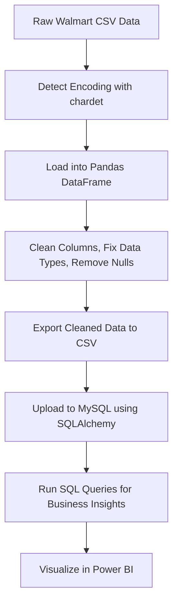

#  Walmart Sales Data Cleaning & Analysis Project

This project demonstrates a complete data pipeline for Walmart sales data using **Python**, **SQL**, and **Power BI**. It covers everything from detecting encoding issues, cleaning raw data, exporting to MySQL, querying with SQL for insights, and finally visualizing the results using Power BI.

---

##  Project Overview

- **Data Source**: Walmart 10K sales dataset from [Kaggle](https://www.kaggle.com/datasets/najir0123/walmart-10k-sales-datasets)
- **Goal**: Transform raw transactional data into clean, analysis-ready insights
- **Tools Used**: Python (pandas, chardet), MySQL, Power BI

---

##  Data Cleaning Process (Python)

-  **Encoding Detection**: Used `chardet` to identify file encoding  
-  **Load Dataset**: Read the data into pandas using the detected encoding  
-  **Clean Columns**: Lowercased column names and stripped whitespace  
-  **Fix Data Types**: Converted `unit_price` from string to float  
-  **Remove Duplicates & Nulls**  
-  **Export**: Saved cleaned CSV and uploaded to MySQL using `sqlalchemy`

---

##  SQL Analysis & Business Insights

Some of the key questions answered:

###  1. What are the most common payment methods?
```sql
SELECT payment_method, COUNT(*) AS no_payments, SUM(quantity) AS no_qty_sold
FROM walmart
GROUP BY payment_method;
```

###  2. Highest-rated category per branch
```sql
SELECT branch, category, AVG(rating) AS avg_rating
FROM walmart
GROUP BY branch, category
ORDER BY branch, avg_rating DESC;
```

###  3. Busiest day per branch
```sql
SELECT branch, DATE_FORMAT(STR_TO_DATE(date, '%d/%m/%y'), '%W') AS day_name, COUNT(*) AS no_transactions
FROM walmart
GROUP BY branch, day_name;
```

###  4. Year-over-Year Revenue Change
```sql
WITH revenue_2022 AS (
  SELECT branch, SUM(total) AS revenue
  FROM walmart
  WHERE EXTRACT(YEAR FROM STR_TO_DATE(date, '%d/%m/%y')) = 2022
  GROUP BY branch
),
revenue_2023 AS (
  SELECT branch, SUM(total) AS revenue
  FROM walmart
  WHERE EXTRACT(YEAR FROM STR_TO_DATE(date, '%d/%m/%y')) = 2023
  GROUP BY branch
)
SELECT 
  r2.branch,
  r2.revenue AS last_year_revenue,
  r3.revenue AS current_year_revenue,
  ROUND((r2.revenue - r3.revenue) / r2.revenue * 100, 2) AS revenue_difference_percentage
FROM revenue_2022 r2
JOIN revenue_2023 r3 ON r2.branch = r3.branch
WHERE r2.revenue > r3.revenue
ORDER BY revenue_difference_percentage DESC;
```

---

##  Power BI Dashboard

An interactive Power BI dashboard showcasing:

- **YTD vs PYTD Revenue**
- **Total Sales by Branch & Product Category**
- **Customer Behavior by Time of Day**
- **Branch-wise Comparison Metrics**

 **Dashboard Preview**:  


---

##  Flowchart: Data Pipeline Overview



---


- Walmart dataset from [https://www.kaggle.com/datasets/najir0123/walmart-10k-sales-datasets]
- Python: [Python Cleaning Script](https://github.com/kChe626/Walmart/blob/main/walmart_python_cleaned_data.ipynbx)
- SQL: [SQL Analysis Script](https://github.com/kChe626/Walmart/blob/main/walmart_sql_analysis.sql)
- Tableau: [Walmart Dashboard PowerBI](https://github.com/kChe626/Walmart/blob/main/Walmart_Dashboard.pbix)
